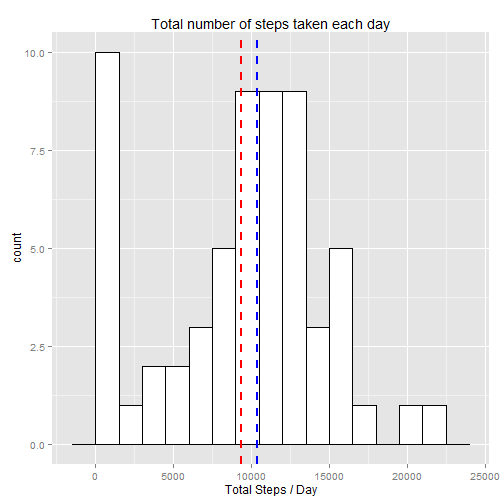

# Reproducible Research: Peer Assessment 1
#### *Gustavo Gialluisi*
#### *Friday, March 13, 2015*

This assignment is about using knitr to build this report with answers to the following questions:  
- Loading and preprocessing the data  
- What is mean total number of steps taken per day?  
- What is the average daily activity pattern?  
- Imputing missing values  
- Are there differences in activity patterns between weekdays and weekends?  


## Loading and preprocessing the data

Let's first load all required R packages, on silent mode...

```r
require(plyr)
require(ggplot2)
```

The file [**activity.zip**](https://d396qusza40orc.cloudfront.net/repdata%2Fdata%2Factivity.zip) is required here.  
If the csv file does not exist, we need to unzip the zip file:

```r
if(!file.exists("activity.csv")){
    unzip ("activity.zip")
}
```

Load data with **read.csv()**:

```r
activity <- read.csv("activity.csv")
```

To count NA values, we'll need a column:

```r
activity$is_NA <- is.na(activity$steps)
```

Have a look at the data:

```r
str(activity)
```

```
## 'data.frame':	17568 obs. of  4 variables:
##  $ steps   : int  NA NA NA NA NA NA NA NA NA NA ...
##  $ date    : Factor w/ 61 levels "2012-10-01","2012-10-02",..: 1 1 1 1 1 1 1 1 1 1 ...
##  $ interval: int  0 5 10 15 20 25 30 35 40 45 ...
##  $ is_NA   : logi  TRUE TRUE TRUE TRUE TRUE TRUE ...
```


## What is mean total number of steps taken per day?
  
We need to summarize steps day by day, I'll use plyr's ddply:

```r
stepsperday <- ddply(activity, 
                     .(date), 
                     summarize, 
                     totalsteps = sum(steps, na.rm = TRUE))
```
Calculate mean and median, and plot Histogram, adding the mean and median:

```r
mn <- mean(stepsperday$totalsteps, na.rm = TRUE)
mn
```

```
## [1] 9354.23
```

```r
md <- median(stepsperday$totalsteps, na.rm = TRUE)
md
```

```
## [1] 10395
```

```r
ggplot(stepsperday, aes(x=totalsteps)) +
    geom_histogram(binwidth=1500, colour="black", fill="white") + 
    geom_vline(aes(xintercept = mn), color="red", linetype="dashed", size = 1) +#MEAN RED
    geom_vline(aes(xintercept = md), color="blue", linetype="dashed", size = 1) + #MEDIAN BLUE
    labs(title = "Total number of steps taken each day", x = "Total Steps / Day")
```

 
   
Mean: <span style="color:red">**9354.23**</span>  
Median: <span style="color:blue">**10395**</span>  
   
   


## What is the average daily activity pattern?

We need to calculate average of steps on each interval, with ddply. And plot a profile:


```r
avgstepsperinterval <- ddply(activity, 
                         .(interval), 
                         summarize, 
                         avg.interval.steps = mean(steps, na.rm = TRUE))

ggplot(avgstepsperinterval, aes(x=interval, y=avg.interval.steps)) +
    geom_line() +
    labs(title = "Average number of steps taken\naveraged across all days", 
         x = "5-minute interval", y = "total steps\naveraged across all days")
```

 

  
Verify which interval contains tha maximum value of the steps average:

```r
theinterval <- avgstepsperinterval[avgstepsperinterval$avg.interval.steps == max(avgstepsperinterval$avg.interval.steps),]

theinterval
```

```
##     interval avg.interval.steps
## 104      835           206.1698
```

The 5-minute interval that contains, on average across all the days in the dataset, the maximum number of steps (**206.1698**) is: **835**.  
    
    
## Imputing missing values


```r
sum(activity$is_NA)
```

```
## [1] 2304
```

Rows containing NA value: **2304** out of a total of **17568** rows (**13.1%** of the rows).  

The strategy for filling in the missing values in the dataset will be replace the 'NA's values with the average of steps calculated for that 5-minute interval.  

I'll do this merging the activity dataset with average of steps for each 5-minute interval dataset calculated above:

```r
activity_fi <- merge(activity, avgstepsperinterval, by="interval")
```

And then replacing NA values with its corresponding average:

```r
activity_fi[activity_fi$is_NA,]$steps <- as.integer(activity_fi[activity_fi$is_NA,]$avg.interval.steps)
```


To check impact of imputing missing data, let's replicate the analisys done in the first part of this assignment.  
ddply to summarize:

```r
stepsperday_fi <- ddply(activity_fi, 
                     .(date), 
                     summarize, 
                     totalsteps = sum(steps, na.rm = TRUE))
```
  

Calculate mean and median, and plot Histogram, adding the mean and median:

```r
mn_fi <- mean(stepsperday_fi$totalsteps, na.rm = TRUE)
mn_fi
```

```
## [1] 10749.77
```

```r
md_fi <- median(stepsperday_fi$totalsteps, na.rm = TRUE)
md_fi
```

```
## [1] 10641
```

```r
ggplot(stepsperday_fi, aes(x=totalsteps)) +
    geom_histogram(binwidth=1500, colour="black", fill="white") + 
    geom_vline(aes(xintercept = mn_fi), color="red", linetype="dashed", size = 1) + #MEAN RED
    geom_vline(aes(xintercept = md_fi), color="blue", linetype="dashed", size = 1) + #MEDIAN BLUE
    labs(title = "Total number of steps taken each day (filled-in data)", x = "Total Steps per Day")
```

 


With the filled-in dataset now we have a nicer distribution, and this mean and median values:    
Mean: <span style="color:red">**10749.77**</span>  
Median: <span style="color:blue">**10641**</span>  

   
   


## Are there differences in activity patterns between weekdays and weekends?

- in order to say if a day is weekend or not, I'll have to check for the weekday name. To make this code work everywhere, I'll have to make a little *save-change-restore* work with language settings. I would turn off echo on this, if it was not explicity asked not to use echo = FALSE... Sorry for any over purism...


```r
# store language settings
user_lang <- Sys.getlocale("LC_TIME")

# set locale to english to correct weekdays names
Sys.setlocale("LC_TIME", "English")
```

- Create the weekend factor column:  


```r
#TRUE for weekend, FALSE for weekday
activity_fi$weekend <-  weekdays(as.Date(activity$date, format = "%Y-%m-%d"), TRUE) %in% c("Sun", "Sat")

#change values, TRUE for "weekend" and FALSE for "weekday"
activity_fi[activity_fi$weekend,]$weekend <- "weekend"
activity_fi[activity_fi$weekend=="FALSE",]$weekend <- "weekday"

#column type needs to be factor
activity_fi$weekend <- factor(activity_fi$weekend)

# sorry for hard R here...
# hope to learn a better command 
# evaluating you, dear peers...tks
```

- restore language settings...  

```r
Sys.setlocale("LC_TIME", user_lang)
```

```
## [1] "English_United States.1252"
```


- Time series plot of the 5-minute interval (x-axis) and the average number of steps taken, averaged across all weekday days or weekend days (y-axis):

```r
avgstepsperinterval_fi <- ddply(activity_fi, 
                                .(interval, weekend), 
                                summarize, 
                                avg.interval.steps = mean(steps, na.rm = TRUE))


ggplot(avgstepsperinterval_fi, aes(x=interval, y=avg.interval.steps)) +
    facet_grid(weekend ~ .) +
    geom_line() +
    labs(title = "Average number of steps taken\nper 5-minute interval across weekdays and weekends", 
         x = "5-minute interval", y = "total steps\navg. across weekdays and weekends")
```

 

The plot above indicates differences in activity patterns between weekdays and weekends, it seems that we walk less on weekends...
